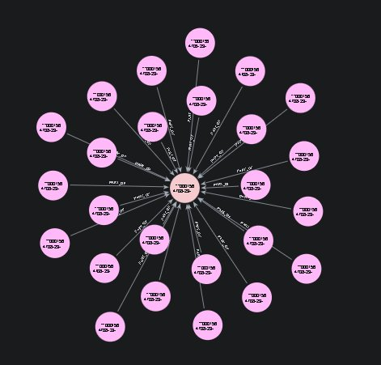

# Form 10-K RAG Pipeline

A Retrieval-Augmented Generation (RAG) pipeline that ingests SEC Form 10-K filings into a Neo4j knowledge graph and enables natural-language Q&A over the documents using LangChain and OpenAI.

## Why Knowledge Graph + RAG?

Standard RAG retrieves chunks by vector similarity alone — each chunk is treated as an isolated fragment, with no awareness of where it sits in the document or how it relates to other pieces of information. Combining RAG with a knowledge graph brings several advantages: 

        - Better retrieval quality. 
        - Faster and more targeted queries. 
        - Reduced hallucination. 
        - Scalability across many documents. 
        - Richer future extensions. 

## How it works

1. A 10-K JSON file is parsed and split into overlapping text chunks.
2. Chunks are written to Neo4j as `:Chunk` nodes, linked sequentially within each section (`NEXT`) and connected to a parent `:Form` node (`PART_OF`, `SECTION`).
3. OpenAI embeddings are generated and stored on each node, powering a vector index.
4. A sliding-window retriever expands each matched chunk with its neighbours before passing context to the LLM, improving answer quality.

## Project structure

```
├── config.py           # Environment variables and constants
├── queries.py          # All Cypher query strings
├── text_processing.py  # 10-K JSON parsing and text chunking
├── graph.py            # Neo4j connection and graph operations
├── vector_store.py     # Neo4jVector store factory functions
├── qa_chain.py         # LangChain QA chain builder and ask() helper
└── main.py             # Pipeline entry point
```

## Prerequisites

- Docker and Docker Compose
- An OpenAI API key

## Running

1. Add your `OPENAI_API_KEY` to the `.env` file.

2. Place your 10-K JSON file under `./forms/`. Update `FORM_FILE` in `main.py` if needed.

3. Start all services (Python app + Neo4j with APOC and GenAI plugins):

```bash
docker compose up --build
```

The pipeline will connect to Neo4j, build the graph, generate embeddings, and print an answer to the configured question. Neo4j Browser is available at `http://localhost:7474` for inspecting the graph.

## Graph structure

The image below shows the `PART_OF` relationship in Neo4j Browser — each outer `:Chunk` node is connected to its parent `:Form` node at the centre.


